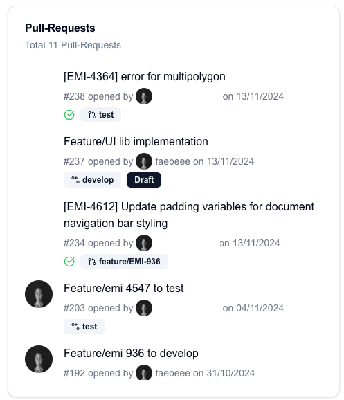

# all-pull-requests

## Preview


## Config
```json
{
    "id": "UNIQUE ID",
    "widget": "all-pull-requests",
    "config": {
      "title": "Pull-Requests",
      "owner": "XXXX",
      "repo": "XXXX"
    }
}
```