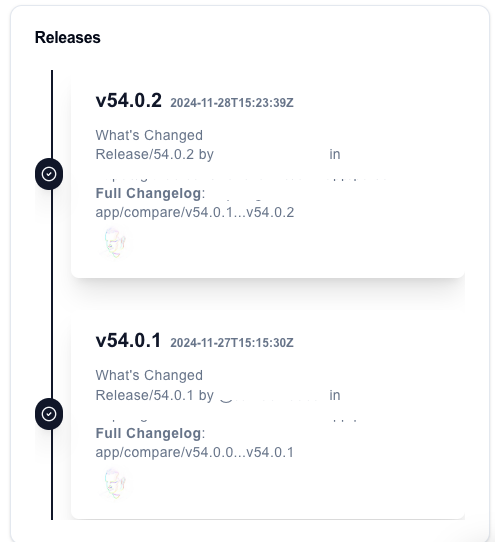
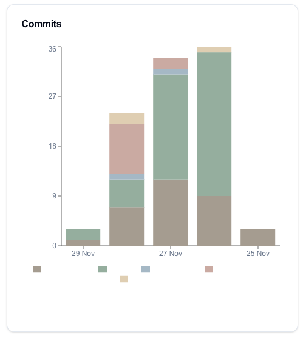
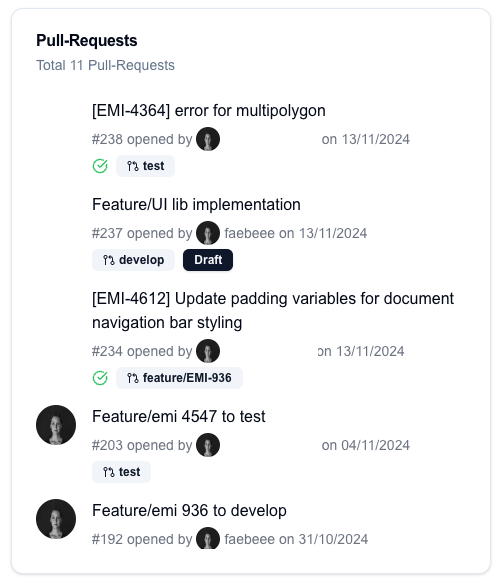
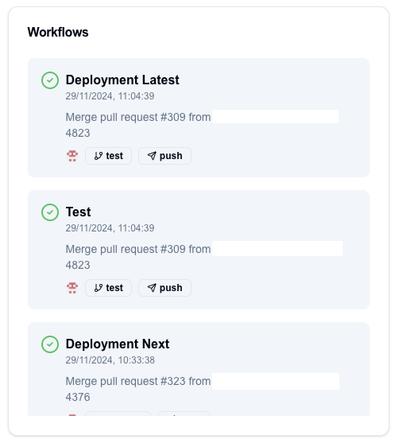

# Github
List of available widgets to interact with github data

## github-repo-events
Shows the latest events for a repo

### Type
`"widget": "repo-events",`

### Config

```json
{
  "id": "",
  "widget": "repo-events",
  "config": {
    "title": "Events",
    "owner": "OWNER",
    "repo": "REPO_NAME"
  }
}
```

---

## github-issues
Shows a list of issues for a github repository

### Type
`"widget": "github-issues",`

### Config

```json
{
        "id": "",
        "widget": "github-issues",
        "config": {
          "title": "Issues",
          "owner": "OWNER",
          "repo": "REPO_NAME"
        }
      }
```

---

## github-commits
Shows a chart with commits for a github repository

### Type
`"widget": "github-commits",`

### Preview



### Config

```json
{
        "id": "",
        "widget": "github-commits",
        "config": {
          "title": "Commits",
          "owner": "OWNER",
          "repo": "REPO_NAME"
        }
      }
```
---

## github-commits-charts
Shows a chart with commits for a github repository

### Type
`"widget": "github-commits-charts",`

### Preview


### Config

```json
{
        "id": "",
        "widget": "github-commits-charts",
        "config": {
          "title": "Commits",
          "owner": "OWNER",
          "repo": "REPO_NAME"
        }
      }
```

---

## pull-requests-to-review

Shows a list of pull-requests assigned to you.

### Type
`"widget": "pull-requests-to-review",`

### Config
```json
{
        "id": "",
        "widget": "pull-requests-to-review",
        "config": {
          "title": "Pull-Requests to review",
          "owner": "OWNER",
          "repo": "REPOSITORY"
        }
      }
```

---

## all-pull-requests

Lists all open pull-requests for a repository

### Preview


### Config
```json
{
    "id": "UNIQUE ID",
    "widget": "all-pull-requests",
    "config": {
      "title": "Pull-Requests",
      "owner": "XXXX",
      "repo": "XXXX"
    }
}
```

---

## my-pull-requests
Shows a list of pull-requests created by you

### Preview


### Config
```json
{
    "id": "UNIQUE ID",
    "widget": "my-pull-requests",
    "config": {
      "title": "Pull-Requests",
      "owner": "XXXX",
      "repo": "XXXX"
    }
}
```

---

## release-history
Shows a list of the release history


### Config
```json
{
    "id": "UNIQUE ID",
    "widget": "release-history",
    "config": {
      "title": "Releases",
      "owner": "XXXX",
      "repo": "XXXX"
    }
}
```

---

## workflow-run
Shows the list of the latest github actions

## Preview


### Config
```json
{
    "id": "UNIQUE ID",
    "widget": "release-history",
    "config": {
      "title": "Releases",
      "owner": "XXXX",
      "repo": "XXXX"
    }
}
```