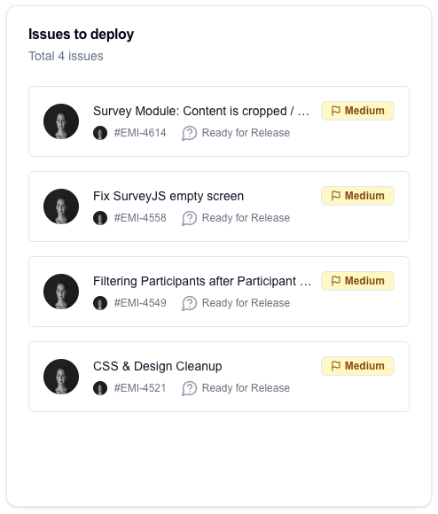

# jira-search

## Preview



## Config
```json
 {
    "id": "UNIQUE ID",
    "widget": "jira-search",
    "config": {
      "title": "Issues to deploy",
      "jql": "sprint in openSprints() and assignee = currentUser() and status IN (Backlog, \"In Progress\", \"In Review\", Open, Ready, Todo) ORDER BY status DESC"
    }
  }
```

`config.jql` can be any Jira query